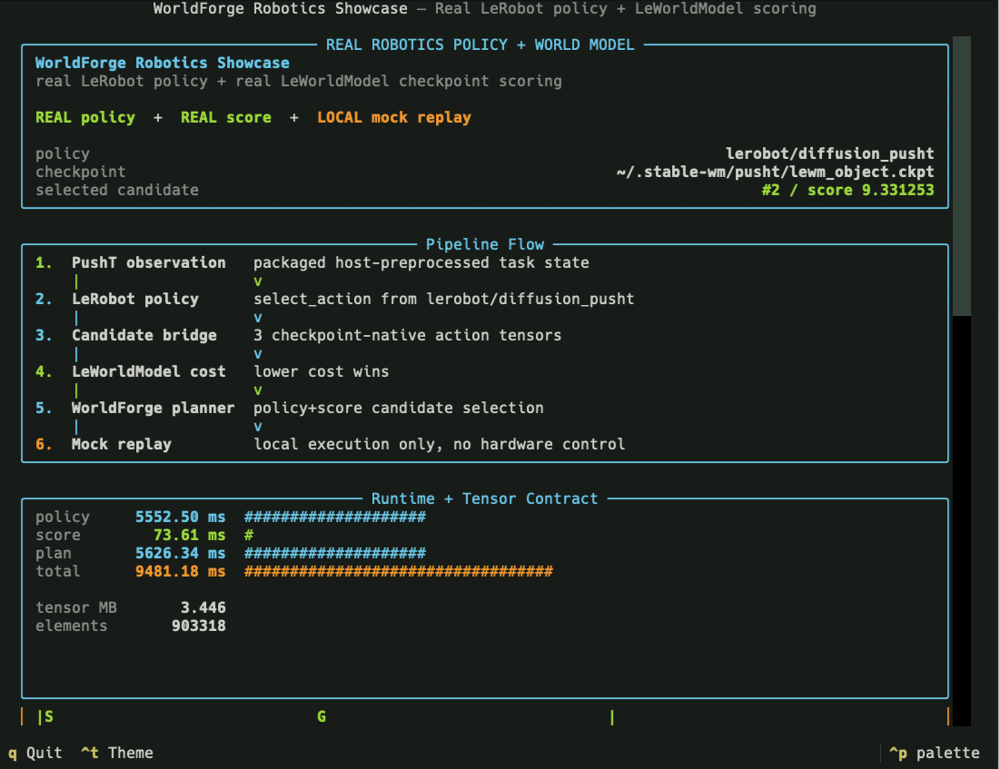

# WorldForge

<p align="center">
  
</p>

<div align="center">

### 🌐 &nbsp; **English** &nbsp; · &nbsp; [简体中文](./README.zh-CN.md)

**A harness for world-model planning loops in physical AI.**

WorldForge is the application builder's counterpart to model-training stacks like Stable World
Model. Those stacks *train* world models. WorldForge helps roboticists *compose, evaluate, and
benchmark* workflows on top of them — so they can pick a provider and configuration for a task.

One backbone loop: **plan and score action candidates with an action-conditioned predictive world
model, in latent space.** Checkpoints, credentials, robot controllers, and deployment stay
host-owned.

Python **3.13** · MIT · one runtime dependency (`httpx`) · [PyPI: `worldforge-ai`](https://pypi.org/project/worldforge-ai/)

[](https://github.com/AbdelStark/worldforge/actions/workflows/ci.yml)
[](https://abdelstark.github.io/worldforge/)
[](https://github.com/AbdelStark/worldforge/blob/main/pyproject.toml)
[](https://pypi.org/project/worldforge-ai/)
[](./LICENSE)
[](./.github/workflows/ci.yml)
[](./src/worldforge/py.typed)
[](https://github.com/astral-sh/ruff)
[](https://github.com/astral-sh/uv)
[](#project-status)
<!-- ALL-CONTRIBUTORS-BADGE:START - Do not remove or modify this section -->
[](#contributors)
<!-- ALL-CONTRIBUTORS-BADGE:END -->

[**Quickstart**](#quickstart) ·
[**Docs**](https://abdelstark.github.io/worldforge/) ·
[**Docs Map**](https://abdelstark.github.io/worldforge/docs-map/) ·
[**Providers**](#provider-surfaces) ·
[**Architecture**](#architecture) ·
[**Contributing**](#contributing) ·
[**Support**](./SUPPORT.md) ·
[**Security**](./SECURITY.md)

</div>

```text
observe
  → policy proposes candidate actions
  → predict rolls futures  /  score ranks them as a cost oracle
  → LatentMPCController selects the lowest-cost chunk   (CEM, receding horizon)
  → execute, evaluate, replan
```

The world model stays a pure oracle. The controller stays a pure optimizer. Each adapter
advertises only the capabilities it actually implements.

## Quickstart

```bash
uv add worldforge-ai
# or: pip install worldforge-ai
```

```python
from worldforge import Action, LatentMPCController, PlannerConfig, WorldForge

forge = WorldForge()

# Action-conditioned forward dynamics on a JSON world-state dict.
prediction = forge.predict(
    {"scene": {"objects": {}}},
    Action.move_to(0.3, 0.8, 0.0),
    provider="mock",
)

# Latent MPC: sample horizons, score them, keep elites, return the lowest-cost chunk.
plan = LatentMPCController(
    forge=forge,
    score_provider="mock",
    config=PlannerConfig(
        horizon=1,
        num_samples=64,
        num_iterations=5,
        num_elites=8,
        action_parameter_bounds={"x": (-1.0, 1.0), "y": (-1.0, 1.0), "z": (-1.0, 1.0)},
        seed=0,
    ),
).plan_step(
    observation_info={"point": [0.0, 0.8, 0.0]},
    goal_info={"target": [0.3, 0.8, 0.0]},
)

print(prediction.physics_score, plan.best_score, plan.actions[0])
```

The `mock` provider needs no credentials, GPU, checkpoint, or robot. Success is a physics score
plus a receding-horizon plan that selected the lowest-cost action.

```bash
uv run worldforge doctor --registered-only
uv run python examples/latent_mpc_planning.py
uv run worldforge predict kitchen --provider mock --x 0.3 --y 0.8 --z 0.0 --steps 2
uv run worldforge eval --suite planning --provider mock --format json
uv run worldforge benchmark --provider mock --operation predict --operation embed
```

Optional extras: `uv add "worldforge-ai[harness]"` (Textual robotics report),
`uv add "worldforge-ai[rerun]"` (event/artifact recording),
`uv add "worldforge-ai[tensorboard]"` (LeWorldModel checkpoint inspection).

Python 3.13 only. From source: `uv add "worldforge-ai @ git+https://github.com/AbdelStark/worldforge"`.
For a checkout: `git clone https://github.com/AbdelStark/worldforge.git && cd worldforge && uv sync --group dev`.

<details>
<summary><strong>CLI surface</strong> — doctor, contracts, eval, and budget gates</summary>

```bash
uv run worldforge examples
uv run worldforge provider list
uv run worldforge provider info mock
uv run worldforge provider contract mock --format json
uv run worldforge negotiate --list
uv run worldforge benchmark --provider mock --operation embed --input-file examples/benchmark-inputs.json
uv run worldforge benchmark --provider mock --operation predict --budget-file examples/benchmark-budget.json
```

`eval` and `benchmark` compare configurations. Budget files turn success rate, latency, and
throughput thresholds into non-zero CLI gates.

Full references: [Python API](https://abdelstark.github.io/worldforge/api/python/) ·
[CLI](https://abdelstark.github.io/worldforge/cli/) ·
[Examples](https://abdelstark.github.io/worldforge/examples/)

</details>

## Robotics Showcase

The front-door robotics demo composes a [Hugging Face LeRobot](https://github.com/huggingface/lerobot)
policy with a [LeWorldModel](https://github.com/lucas-maes/le-wm) checkpoint. LeRobot proposes PushT
action candidates, WorldForge bridges them into LeWorldModel-native tensors, LeWorldModel scores
them, and WorldForge selects the lowest-cost chunk for local mock replay.

This is simulation/replay planning: real policy inference, real score-model inference, typed
composition, candidate ranking, and visual replay. Hardware control, safety, robot controllers, and
task-specific preprocessing stay host-owned.

For measured decision evidence without a live robot, the Go2 Air ControlBench trace replay
reranks public DecisionTrace fixtures and reports native-odometry regret. It does not import DimOS,
Unitree SDKs, or connect hardware:

```bash
uv run python examples/go2-controlbench-decisiontrace/run.py
```

<div align="center">
<table>
  <tr>
    <td width="50%">
      
      <br />
      <sub><strong>Pipeline:</strong> real policy, real score checkpoint, WorldForge planner, local mock replay.</sub>
    </td>
    <td width="50%">
      
      <br />
      <sub><strong>Decision:</strong> candidate ranking, robot-arm illustration, and fixed tabletop replay.</sub>
    </td>
  </tr>
</table>
</div>

```bash
scripts/robotics-showcase
uv run python scripts/demo_showcases.py run all --workspace-dir .worldforge/demo-showcases
```

The first command launches a staged Textual report, writes
`/tmp/worldforge-robotics-showcase/real-run.json`, and records
`/tmp/worldforge-robotics-showcase/real-run.rrd`. Press `o` in the TUI to open Rerun.
`--no-tui` prints the terminal report; `--json-only` is for automation; `--health-only` is a
non-mutating preflight. Pin auto-built LeWorldModel assets with
`--lewm-revision <40-char-commit-sha>`.

The second command is checkout-safe: no credentials or optional model runtimes.

Walkthrough: [Robotics Replay Showcase](https://abdelstark.github.io/worldforge/robotics-showcase/) ·
[Technical deep dive](https://abdelstark.github.io/worldforge/robotics-showcase-deep-dive/) ·
[Rerun](https://abdelstark.github.io/worldforge/rerun/) ·
[Demo showcases](https://abdelstark.github.io/worldforge/demo-showcases/)

<details>
<summary><strong>TUI, Rerun, and live CI</strong></summary>

```bash
scripts/robotics-showcase --no-tui
uv run --extra rerun worldforge-demo-rerun
uvx --from "rerun-sdk>=0.24,<0.32" rerun /tmp/worldforge-robotics-showcase/real-run.rrd
```

Rerun is an optional observability extra, not a provider capability or base dependency. The
checkout-safe demo records events, snapshots, plans, traces, and benchmark metrics. The robotics
showcase records the real PushT policy+score run.

`.github/workflows/robotics-showcase.yml` runs `scripts/robotics-showcase --json-only --no-tui --no-rerun`
on pull requests and `main`. It caches Hugging Face and LeWorldModel assets; CI uploads JSON and
`run_manifest.json` evidence and does not upload checkpoints.

</details>

## Capability Model

A capability is an operation an adapter actually supports, not the upstream model's branding.
Unknown names raise. Unsupported calls raise. Empty results are not a substitute for "not
implemented."

| Capability | Contract | Example providers |
| --- | --- | --- |
| `predict` | `state + action → predicted state` | `mock` |
| `score` | `observations + goal + candidates → ranked candidates` | `leworldmodel`, `mock` |
| `policy` | `observation + instruction → action chunks` | `lerobot`, `gr00t`, `cosmos-policy` |
| `embed` | observation → embedding | `mock` |
| `plan` | facade over composed surfaces | WorldForge / `LatentMPCController` |

Register a full `BaseProvider`, or a narrow `Cost`, `Policy`, `Predictor`, or `Embedder` protocol
implementation. The protocol path is one name, optional profile metadata, and the one method behind
the advertised capability.

LeWorldModel is a score provider, not a video generator. Cosmos-Policy, GR00T, and LeRobot are
policy providers, not predictive world models. The planning backbone composes those narrow
surfaces.

## Provider Surfaces

<!-- provider-catalog-readme:start -->
| Provider | Maturity | Capability surface | Registration | Runtime ownership |
| --- | --- | --- | --- | --- |
| `mock` | `stable` | `predict`, `score`, `embed` | always registered | in-repo deterministic local provider |
| [`cosmos-policy`](https://abdelstark.github.io/worldforge/providers/cosmos-policy/) | `beta` | none (`policy` requires host `action_translator`) | `COSMOS_POLICY_BASE_URL` | WorldForge validates `/act` request/response and planning composition; host owns Cosmos-Policy reachability/CUDA/runtime, ALOHA observation construction, and translation of raw 14D rows into executable `Action` objects |
| [`leworldmodel`](https://abdelstark.github.io/worldforge/providers/leworldmodel/) | `stable` | `score` | `LEWORLDMODEL_POLICY` or `LEWM_POLICY` | host installs the official LeWM loading path (`stable_worldmodel.policy.AutoCostModel`), torch, and compatible checkpoints |
| [`gr00t`](https://abdelstark.github.io/worldforge/providers/gr00t/) | `beta` | `policy` | `GROOT_POLICY_HOST` | host runs or reaches an Isaac GR00T policy server |
| [`lerobot`](https://abdelstark.github.io/worldforge/providers/lerobot/) | `stable` | `policy` | `LEROBOT_POLICY_PATH` or `LEROBOT_POLICY` | host installs LeRobot and compatible policy checkpoints |
| [`jepa`](https://abdelstark.github.io/worldforge/providers/jepa/) | `experimental` | `score` | `JEPA_MODEL_NAME` | host supplies torch, facebookresearch/jepa-wms runtime dependencies, and task preprocessing |
| [`genie`](https://abdelstark.github.io/worldforge/providers/genie/) | `scaffold` | scaffold | `GENIE_API_KEY` | capability-fail-closed reservation; Project Genie has no supported automation API contract |
<!-- provider-catalog-readme:end -->

`jepa` is a score-only adapter for host-owned `facebookresearch/jepa-wms` torch-hub runtimes.
`genie` remains a capability-closed reservation. Candidates stay outside package exports and
auto-registration until they have a validated runtime path, typed parser coverage, request limits,
and docs.

## Architecture

```text
┌──────────────────────────────────────────────────────────┐
│  Host application / CLI                                  │
└────────────────────────────┬─────────────────────────────┘
                             │
                             ▼
┌──────────────────────────────────────────────────────────┐
│  WorldForge                                              │
│  catalog · capability dispatch · diagnostics · eval      │
│                                                          │
│     LatentMPCController   (CEM / receding horizon)       │
└──────────────┬─────────────────────────────┬─────────────┘
               │ score / predict / policy    │
               ▼                             ▼
┌───────────────────────────┐    ┌─────────────────────────┐
│  Provider adapter         │    │  Typed results          │
│  contract · validation    │───▶│  scores, plans, payloads│
│  events                   │    └─────────────────────────┘
└──────────────┬────────────┘
               │
               ▼
┌──────────────────────────────────────────────────────────┐
│  Upstream runtime (host-owned)                           │
│  mock · LeWorldModel · LeRobot · GR00T · Cosmos-Policy   │
└──────────────────────────────────────────────────────────┘
```

There is no symbolic `World` runtime and no built-in world store. Planning runs over plain JSON
world-state dicts. Durable persistence, robot execution, and optional ML runtimes are host-owned.

| WorldForge owns | Host owns |
| --- | --- |
| Capability contracts, validation, fail-closed dispatch | Credentials, endpoints, checkpoints, CUDA |
| CEM / receding-horizon optimizer | Action-space mapping, preprocessing, safety |
| Evaluation, benchmarks, diagnostics, traces | Empirical task claims, robot control, telemetry |

## Project Status

WorldForge is **pre-1.0 beta** (`0.5.0`). Public APIs can still change when the contract needs to
tighten; breaking changes are recorded in the [changelog](./CHANGELOG.md).

| This is | This is not |
| --- | --- |
| An integration layer for provider-backed planning loops | A hosted service, model API, or training framework |
| Typed, fail-closed capabilities with recorded runs | A claim of physical fidelity or robot safety |
| Checkout-safe `mock` plus host-owned optional runtimes | torch / LeRobot / GR00T / CUDA in the base package |
| Evaluation and benchmark *contract* harnesses | A leaderboard or media-quality metric |

The [claim-to-evidence map](https://abdelstark.github.io/worldforge/claim-evidence-map/) links
README-level capability and runtime claims to tests, commands, artifacts, and non-claims.

## Development

```bash
uv sync --group dev
uv lock --check
uv run ruff check src tests examples scripts
uv run ruff format --check src tests examples scripts
uv run python scripts/generate_provider_docs.py --check
uv run python scripts/check_docs_commands.py
uv run python scripts/check_docs_snippets.py
uv run python scripts/check_wrapper_portability.py
uv run python scripts/check_optional_import_boundaries.py
uv run python scripts/check_core_performance.py
uv run mkdocs build --strict
uv run pytest
uv run --extra harness pytest --cov=src/worldforge --cov-report=term-missing --cov-fail-under=90
bash scripts/test_package.sh
uv build --out-dir dist --clear --no-build-logs
```

Before a tag, run the locked dependency audit and generate release evidence, notes, and the quality
dashboard. Raw details are sanitized so host-local paths, signed URLs, and secret-shaped keys stay
out of attachable output. Expanded gate and triage:
[operator playbooks](https://abdelstark.github.io/worldforge/playbooks/#9-prepare-a-release-or-public-branch).
If local setup fails first, run
`uv run python scripts/contributor_doctor.py --format markdown`.

```bash
uv run python scripts/scaffold_provider.py "Acme WM" \
  --taxonomy "JEPA latent predictive world model" \
  --implementation-status scaffold \
  --planned-capability score
```

Contributor guide: [CONTRIBUTING.md](./CONTRIBUTING.md). Agent context: [AGENTS.md](./AGENTS.md).

## Citing WorldForge

```bibtex
@software{worldforge,
  title   = {WorldForge: An integration layer for physical-AI world models},
  author  = {AbdelStark and {WorldForge contributors}},
  year    = {2026},
  url     = {https://github.com/AbdelStark/worldforge},
  version = {0.5.0}
}
```

## Contributing

Issues, discussions, and pull requests are welcome. Read [CONTRIBUTING.md](./CONTRIBUTING.md) and
open an issue for non-trivial changes before sending a patch. Provider work starts at the
[provider authoring guide](https://abdelstark.github.io/worldforge/provider-authoring-guide/) and
[playbooks](https://abdelstark.github.io/worldforge/playbooks/). External adopters can share
integration stories through the
[adoption case-study template](./docs/src/adoption-case-studies/README.md).

## License

WorldForge is released under the [MIT License](./LICENSE).

## Resources

| Resource | Link |
| --- | --- |
| Documentation | <https://abdelstark.github.io/worldforge/> |
| Quickstart | <https://abdelstark.github.io/worldforge/quickstart/> |
| Architecture | <https://abdelstark.github.io/worldforge/architecture/> |
| Playbooks | <https://abdelstark.github.io/worldforge/playbooks/> |
| Provider authoring | <https://abdelstark.github.io/worldforge/provider-authoring-guide/> |
| World-model taxonomy | <https://abdelstark.github.io/worldforge/world-model-taxonomy/> |
| Rerun | <https://abdelstark.github.io/worldforge/rerun/> |
| Quality | <https://abdelstark.github.io/worldforge/quality/> |
| Claim evidence | <https://abdelstark.github.io/worldforge/claim-evidence-map/> |
| Contributing | [CONTRIBUTING.md](./CONTRIBUTING.md) |
| Security | [SECURITY.md](./SECURITY.md) |
| Repository | <https://github.com/AbdelStark/worldforge> |
| Issues | <https://github.com/AbdelStark/worldforge/issues> |

## Contributors

<!-- ALL-CONTRIBUTORS-LIST:START - Do not remove or modify this section -->
<!-- prettier-ignore-start -->
<!-- markdownlint-disable -->
<table>
  <tbody>
    <tr>
      <td align="center" valign="top" width="14.28%"><a href="https://github.com/AbdelStark"><br /><sub><b>Abdel</b></sub></a><br /><a href="https://github.com/AbdelStark/worldforge/commits?author=AbdelStark" title="Code">💻</a> <a href="#ideas-AbdelStark" title="Ideas, Planning, & Feedback">🤔</a> <a href="#projectManagement-AbdelStark" title="Project Management">📆</a></td>
      <td align="center" valign="top" width="14.28%"><a href="https://github.com/0xLucqs"><br /><sub><b>0xLucqs</b></sub></a><br /><a href="https://github.com/AbdelStark/worldforge/commits?author=0xLucqs" title="Code">💻</a></td>
      <td align="center" valign="top" width="14.28%"><a href="https://github.com/Th0rgal"><br /><sub><b>Thomas Marchand</b></sub></a><br /><a href="https://github.com/AbdelStark/worldforge/commits?author=Th0rgal" title="Code">💻</a></td>
      <td align="center" valign="top" width="14.28%"><a href="https://github.com/omarespejel"><br /><sub><b>Omar U. Espejel</b></sub></a><br /><a href="https://github.com/AbdelStark/worldforge/commits?author=omarespejel" title="Code">💻</a></td>
      <td align="center" valign="top" width="14.28%"><a href="https://github.com/adrienlacombe"><br /><sub><b>Adrien Lacombe</b></sub></a><br /><a href="https://github.com/AbdelStark/worldforge/commits?author=adrienlacombe" title="Code">💻</a></td>
    </tr>
  </tbody>
</table>

<!-- markdownlint-restore -->
<!-- prettier-ignore-end -->

<!-- ALL-CONTRIBUTORS-LIST:END -->

Made with love by [Abdel](https://github.com/AbdelStark) and the WorldForge community.
