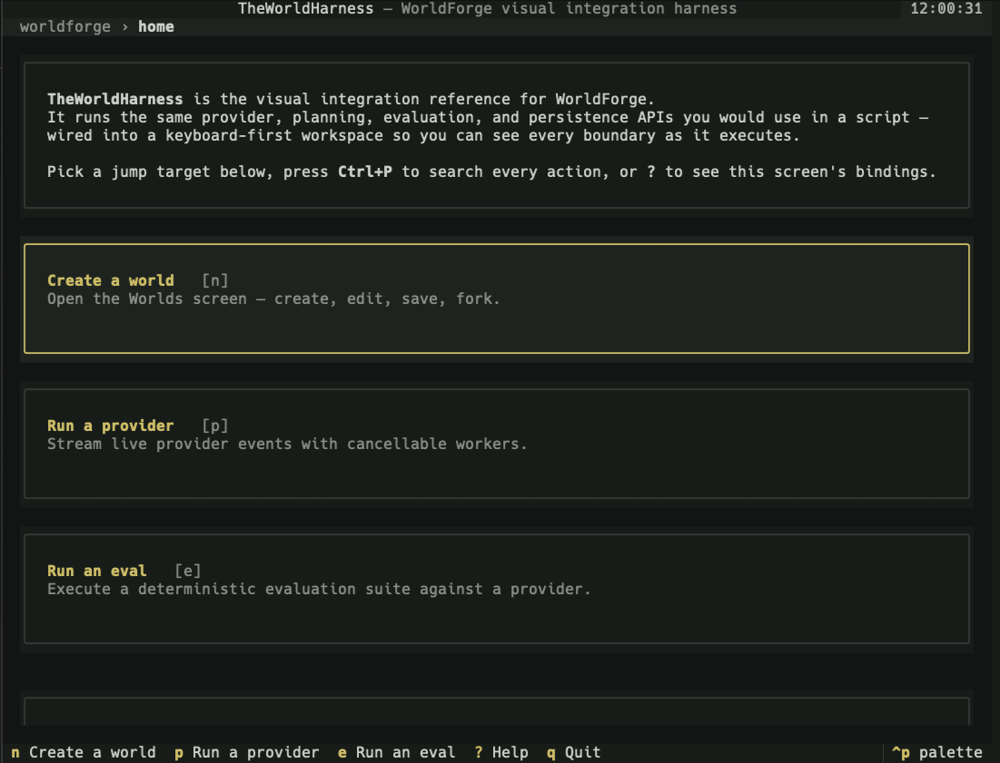
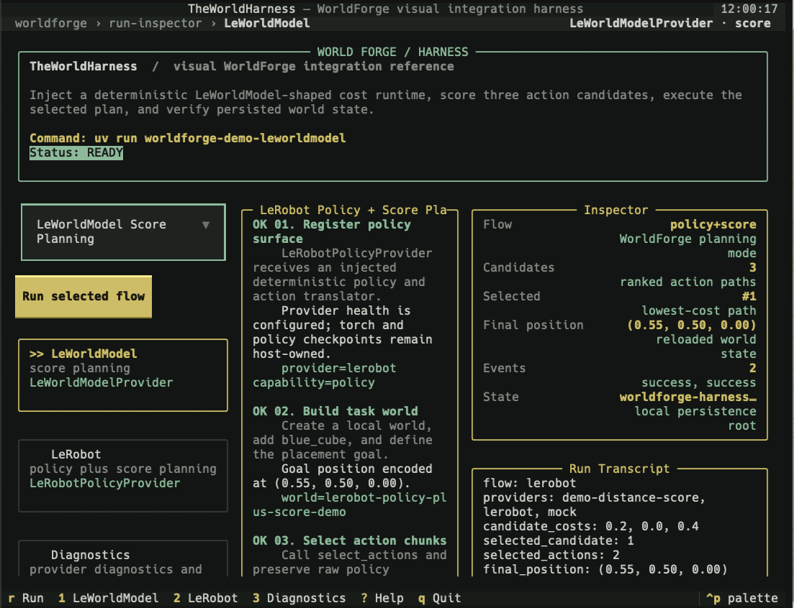
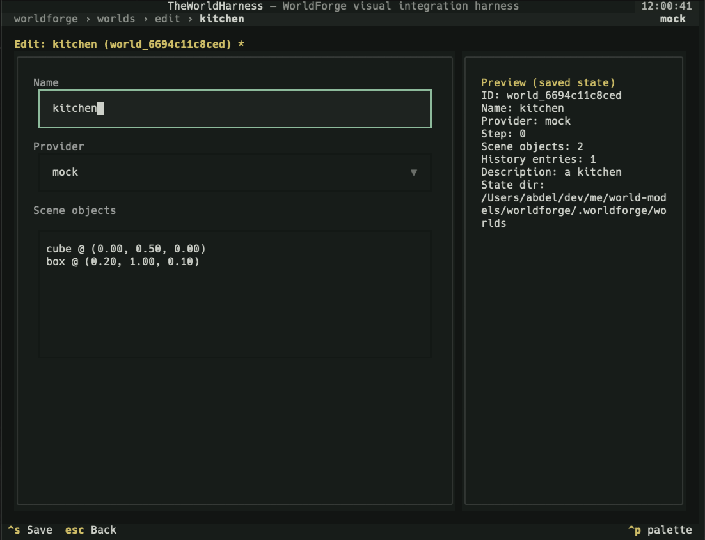
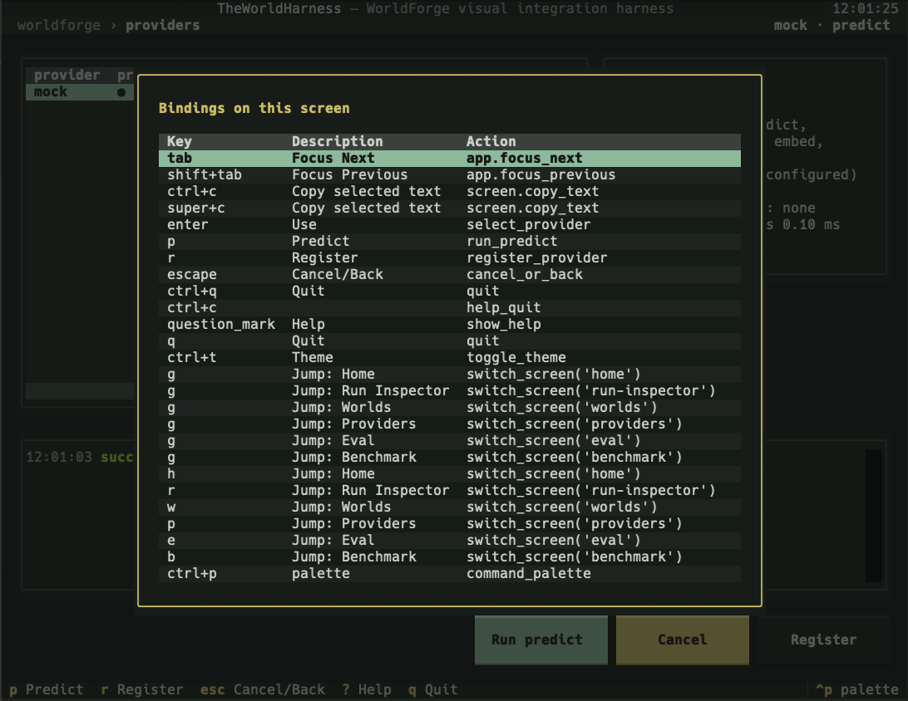

# WorldForge

<p align="center">
  
</p>

<div align="center">

### 🌐 &nbsp; [English](./README.md) &nbsp; · &nbsp; **简体中文**

**用于构建面向物理 AI 系统的、基于世界模型的工作流的框架（harness）。**

WorldForge 面向物理 AI 应用的构建者，是 Stable World Model 等「模型训练」栈的对位补充：它帮助机器人
与物理 AI 构建者在世界模型之上**组合、评估并基准测试**工作流，从而为具体任务挑选最合适的提供方与配置，
而不是去训练这些模型。整个框架围绕一个主干循环组织：**用动作条件化的预测世界模型，在潜空间中对动作
候选进行规划与打分。** 一个 `policy` 提供方提出候选动作，一个 `predict` 提供方将其作为前向动力学展开，
一个 `score` 提供方将其作为代价预言机进行排序，而 `LatentMPCController` 负责 CEM/滚动时域优化器。
检查点、凭据、机器人控制器与部署仍由宿主方持有。

[](https://github.com/AbdelStark/worldforge/actions/workflows/ci.yml)
[](https://abdelstark.github.io/worldforge/)
[](https://github.com/AbdelStark/worldforge/blob/main/pyproject.toml)
[](https://pypi.org/project/worldforge-ai/)
[](./LICENSE)
[](./.github/workflows/ci.yml)
[](./src/worldforge/py.typed)
[](https://github.com/astral-sh/ruff)
[](https://github.com/astral-sh/uv)
[](https://github.com/AbdelStark/worldforge/releases)

[**快速开始**](#快速开始) ·
[**文档导航**](https://abdelstark.github.io/worldforge/docs-map/) ·
[**CLI**](https://abdelstark.github.io/worldforge/cli/) ·
[**案例展示**](https://abdelstark.github.io/worldforge/demo-showcases/) ·
[**提供方**](#提供方接口) ·
[**Rerun**](https://abdelstark.github.io/worldforge/rerun/) ·
[**能力模型**](#能力模型) ·
[**架构**](#架构) ·
[**质量**](https://abdelstark.github.io/worldforge/quality/) ·
[**证据**](https://abdelstark.github.io/worldforge/claim-evidence-map/) ·
[**文档**](https://abdelstark.github.io/worldforge/) ·
[**操作手册**](https://abdelstark.github.io/worldforge/playbooks/) ·
[**支持**](./SUPPORT.md) ·
[**安全**](./SECURITY.md)

</div>

## WorldForge 的作用

WorldForge 让混合的物理 AI 工作流变得明确且可检视。

- **策略提供方根据机器人观测或任务指令提出动作块。**
- **打分与世界模型提供方对候选未来进行排序**，而不是假装每个模型都拥有相同的接口。
- **WorldForge 通过类型化的提供方契约校验、记录、回放并对比各次运行。**
- **TheWorldHarness 与 Rerun 让整个循环可见**，在宿主方接入真实机器人硬件之前即可观察。

## 首次运行

安装该软件包，然后打开可在干净检出环境中安全运行的机器人对比流程：

```bash
uv add "worldforge-ai[harness]"
uv run worldforge-harness --flow robotics-compare
```

该流程从经过脱敏的回放工件中对比 LeRobot、Cosmos-Policy 和 GR00T 的策略接口，因此无需凭据、
检查点、GPU 或机器人。

成功的标志是 TUI 打开后显示 **Robotics Policy Replay Comparison**，并带有成功的提供方事件以及
`gpu_required=false`。如果失败，请先重新运行
`uv run worldforge-harness --flow robotics-compare --no-animation` 以移除逐步揭示的延时，让失败的
步骤或调用栈立即显示在 TUI 中。

## 机器人案例展示：LeRobot + LeWorldModel

WorldForge 的门面级机器人演示将一个
[Hugging Face LeRobot](https://github.com/huggingface/lerobot) 策略与一个
[LeWorldModel](https://github.com/lucas-maes/le-wm) 检查点组合在一起。LeRobot 提出 PushT 候选动作，
WorldForge 将这些策略动作桥接为 LeWorldModel 原生的候选张量，LeWorldModel 对候选进行打分，
随后 WorldForge 选出代价最低的动作块并以 mock 方式回放。

LeWorldModel 的运行时路径刻意遵循官方 LeWM 加载契约：
`stable_worldmodel.policy.AutoCostModel("pusht/lewm")` 加载 Lucas Maes 的 LeWM 对象检查点。
`stable-worldmodel` 是官方 LeWorldModel 仓库所使用的运行时/评估库，而非替代的打分模型。

这是仿真/回放规划。它演示了策略推理、打分模型推理、类型化的提供方组合、候选排序、事件捕获以及
可视化回放。硬件控制、安全检查、机器人控制器集成以及任务相关的预处理都仍由宿主方持有。

<div align="center">
<table>
  <tr>
    <td width="50%">
      
      <br />
      <sub><strong>流水线：</strong>真实策略、真实打分检查点、WorldForge 规划器、本地 mock 回放。</sub>
    </td>
    <td width="50%">
      
      <br />
      <sub><strong>决策：</strong>候选排序、机械臂示意图，以及固定的桌面回放。</sub>
    </td>
  </tr>
</table>
</div>

```bash
scripts/robotics-showcase
uv run python scripts/demo_showcases.py run all --workspace-dir .worldforge/demo-showcases
```

第一条命令默认启动一个分阶段的 Textual 报告，将相同的运行数据写入
`/tmp/worldforge-robotics-showcase/real-run.json`，并将可视化的 Rerun 录制写入
`/tmp/worldforge-robotics-showcase/real-run.rrd`。在 TUI 中按 `o` 可在 Rerun 中打开该录制。
使用 `--tui-stage-delay 0.1` 可加快揭示速度，`--no-tui-animation` 可跳过停顿与机械臂动作，
`--no-tui` 可输出纯终端报告，`--no-rerun` 可跳过 Rerun 工件，`--json-only` 用于自动化，
`--health-only` 则执行非改动式的依赖/检查点预检。使用 `--lewm-revision <40-char-commit-sha>` 可固定
自动构建的 LeWorldModel 资产。第二条命令在无需外部凭据的情况下运行可在干净检出环境中安全运行的
演示案例套件。

可选的在线机器人工作流 `.github/workflows/robotics-showcase.yml` 会在每次拉取请求运行以及推送到
`main` 时，以非交互式 JSON 模式运行同一个案例展示。它使用 `actions/cache` 缓存 Hugging Face 下载、
LeWorldModel 构建资产以及已构建的对象检查点；CI 会将 `real-run.json`、`stdout.json` 与
`run_manifest.json` 作为证据上传，而检查点工件不会被上传。

阅读演练与实现说明：[机器人回放案例](https://abdelstark.github.io/worldforge/robotics-showcase/)
以及 [机器人案例技术深入解析](https://abdelstark.github.io/worldforge/robotics-showcase-deep-dive/)。

<details>
<summary><strong>TheWorldHarness TUI</strong> —— 面向世界、提供方、评估、基准测试与打包流程的、可在干净检出环境中安全运行的可视化运行框架</summary>

TheWorldHarness 是一个可选的 Textual 工作区，可在不安装机器人或模型运行时的情况下检视 WorldForge
流程。它通过 `harness` 附加扩展运行可在干净检出环境中安全运行的演示、提供方诊断、基准测试对比、
世界编辑以及已保存报告的预览。

```bash
uv run --extra harness worldforge-harness
uv run --extra harness worldforge-harness --flow lerobot
uv run --extra harness worldforge-harness --flow cosmos-policy
uv run --extra harness worldforge-harness --flow gr00t-replay
uv run --extra harness worldforge-harness --flow robotics-compare
uv run --extra harness worldforge-harness --flow diagnostics
```

<div align="center">
<table>
  <tr>
    <td width="50%">
      
      <br />
      <sub><strong>主页：</strong>面向世界、提供方、评估与帮助的、以键盘操作为先的启动台。</sub>
    </td>
    <td width="50%">
      
      <br />
      <sub><strong>运行检视器：</strong>带有打分计划、指标与转录文本的流程轨迹。</sub>
    </td>
  </tr>
  <tr>
    <td width="50%">
      
      <br />
      <sub><strong>世界编辑器：</strong>将持久化的场景状态、对象、提供方与预览集中于一处。</sub>
    </td>
    <td width="50%">
      
      <br />
      <sub><strong>提供方帮助：</strong>在实时提供方诊断之上提供可发现的快捷键。</sub>
    </td>
  </tr>
</table>
</div>

更多细节：[TheWorldHarness 文档](https://abdelstark.github.io/worldforge/theworldharness/)。

</details>

<details>
<summary><strong>Rerun 可观测性</strong> —— 面向事件、世界快照、计划与基准测试工件的可选记录层</summary>

WorldForge 可以将经过脱敏的提供方事件与运行工件流式传输到
[Rerun](https://github.com/rerun-io/rerun)，而不会将 Rerun 变成提供方或基础依赖。

```bash
uv run --extra rerun worldforge-demo-rerun
uv run --extra rerun rerun .worldforge/rerun/worldforge-rerun-showcase.rrd
scripts/robotics-showcase
uvx --from "rerun-sdk>=0.24,<0.32" rerun /tmp/worldforge-robotics-showcase/real-run.rrd
```

可在干净检出环境中安全运行的 Rerun 演示会将提供方事件日志、世界快照、一份预测计划、工作流轨迹工件、
3D 物体包围盒以及基准测试指标记录到一个本地 `.rrd` 文件中。机器人案例展示则记录真实的 PushT
策略+打分运行，包含候选目标点、所选轨迹、打分条、延迟条、提供方事件、计划载荷以及回放快照。
在可安全运行的演示中，使用 `--spawn`、`--connect-url` 或 `--serve-grpc-port` 可启用实时查看器工作流。

更多细节：[Rerun 集成文档](https://abdelstark.github.io/worldforge/rerun/)。

</details>

---

## 概览

打分模型、机器人策略服务器、视频模拟器与远程媒体 API 具有不同的输入、运行时与故障模式。WorldForge
不会抹平这些差异。每个提供方适配器都声明它支持八项能力中的哪些（`predict`、`score`、`policy`、
`generate`、`transfer`、`reason`、`embed`、`plan`）。该契约是严格且失败即关闭的：调用不受支持的能力
会抛出异常，而不是悄无声息地返回空结果。

规划、评估、基准测试、诊断与持久化都构建在该契约之上，而非依赖任何特定运行时。
基准测试预算文件可以将成功率、错误数、重试数、延迟与吞吐量阈值转化为非零退出的 CLI 闸门，用于发布
检查或保留的基准测试主张。
[主张到证据映射](https://abdelstark.github.io/worldforge/claim-evidence-map/)将公开的能力与运行时主张
关联到具体的测试、命令、工件以及非主张项。

WorldForge 不是托管服务、模型 API 抽象层，也不是训练框架。可选运行时、机器人技术栈、凭据、检查点与
持久化存储仍是宿主应用的职责。

## 亮点

| | |
| --- | --- |
| **能力契约** | 八项具名能力。适配器只声明它真正实现的能力，并返回类型化的 WorldForge 结果。未知的名称会抛出异常，而不是表现得像空过滤器。 |
| **可组合的规划** | 在单个规划循环中组合预测、打分与策略提供方。对候选排序、推演未来、执行动作、持久化状态。 |
| **默认确定性** | 内置 `mock` 提供方、可复用的契约断言（`worldforge.testing`），以及无需凭据或 GPU 即可从干净检出环境运行的打包演示。 |
| **运行时由宿主方持有** | 基础依赖中不含 torch、CUDA、机器人控制器或检查点。LeWorldModel、GR00T、LeRobot、Cosmos 与 Runway 通过各自的接口集成。 |
| **诊断** | `worldforge doctor`、提供方事件、工作流轨迹、基准测试与评估运行框架，以及可选的 Textual TUI（`TheWorldHarness`）。 |
| **Rerun 可观测性** | 可选的 `rerun-sdk` 桥接，用于事件流、工作流轨迹、世界快照、计划与基准测试工件。 |
| **质量闸门** | `py.typed`、导入隔离的 pytest、ruff、90% 的覆盖率下限、严格的文档构建，以及 CI 在 Python 3.13 上的 wheel + sdist 契约测试。 |

## 安装

### 库（推荐）

```bash
# 从 PyPI 安装（推荐）
uv add worldforge-ai
# 或
pip install worldforge-ai
```

Python 导入路径保持不变：

```python
import worldforge
```

如果需要可选的 Textual 运行框架界面：

```bash
uv add "worldforge-ai[harness]"
```

如果需要由 Rerun 支持的事件与工件记录：

```bash
uv add "worldforge-ai[rerun]"
```

如果需要用 TensorBoard 检视机器人案例展示期间使用的 LeWorldModel 检查点：

```bash
uv add "worldforge-ai[tensorboard]"
```

### 从源码安装（最新开发版）

```bash
uv add "worldforge-ai @ git+https://github.com/AbdelStark/worldforge"
```

### 仓库开发

```bash
git clone https://github.com/AbdelStark/worldforge.git
cd worldforge
uv sync --group dev
cp .env.example .env
```

可选附加扩展：

```bash
uv sync --group dev --extra harness   # TheWorldHarness Textual TUI
uv sync --group dev --extra rerun     # Rerun 事件与工件记录
uv sync --group dev --extra tensorboard  # TensorBoard LeWorldModel 检查点检视
```

仅支持 Python 3.13。基础安装仅依赖 `httpx`。可选运行时由宿主方持有。

## 快速开始

最短的路径是 `mock` 提供方：它可从干净检出环境运行，并使用与更丰富运行时相同的类型化世界、提供方、
规划、持久化与诊断接口。

完整参考：
[Python API](https://abdelstark.github.io/worldforge/api/python/) ·
[CLI 参考](https://abdelstark.github.io/worldforge/cli/) ·
[示例索引](https://abdelstark.github.io/worldforge/examples/)

<details>
<summary><strong>Python API 示例</strong></summary>

```python
from worldforge import Action, BBox, Position, SceneObject, StructuredGoal, WorldForge

forge = WorldForge()
world = forge.create_world("kitchen", provider="mock")

world.add_object(
    SceneObject(
        "red_mug",
        Position(0.0, 0.8, 0.0),
        BBox(Position(-0.05, 0.75, -0.05), Position(0.05, 0.85, 0.05)),
    )
)

prediction = world.predict(Action.move_to(0.3, 0.8, 0.0), steps=2)
print(prediction.provider, prediction.physics_score)

plan = world.plan(
    goal_spec=StructuredGoal.object_at(
        object_name="red_mug",
        position=Position(0.3, 0.8, 0.0),
    )
)
print(plan.action_count, plan.success_probability)

doctor = forge.doctor()
print(doctor.healthy_provider_count, doctor.provider_count)
```

</details>

<details>
<summary><strong>CLI 示例</strong></summary>

```bash
uv run worldforge examples                                              # 可运行脚本索引
uv run worldforge doctor --registered-only                              # 活跃提供方的健康状况
uv run worldforge world create lab --provider mock                      # 保存一个本地世界
uv run worldforge world add-object <world-id> cube --x 0 --y 0.5 --z 0  # 编辑场景状态
uv run worldforge world predict <world-id> --object-id <object-id> --x 0.4 --y 0.5 --z 0
uv run worldforge world list                                            # 已持久化的世界
uv run worldforge world objects <world-id>                              # 场景对象
uv run worldforge world history <world-id>                              # 对象编辑 + 预测
uv run worldforge world preflight                                       # 只读的本地状态诊断
uv run worldforge world migration-preview <world-id>                    # 只读的结构审查
uv run worldforge world export <world-id> --output world.json           # 可移植的状态 JSON
uv run worldforge world delete <world-id>                               # 移除本地 JSON 状态
uv run worldforge provider list                                         # 已注册的提供方
uv run worldforge provider info mock                                    # 能力与生命周期接口
uv run worldforge provider contract mock --format json                  # 可附带的契约证据
uv run worldforge predict kitchen --provider mock --x 0.3 --y 0.8 --z 0.0 --steps 2
uv run worldforge eval --suite planning --provider mock --format json
uv run worldforge benchmark --provider mock --iterations 5 --format json
uv run worldforge benchmark --provider mock --operation embed --input-file examples/benchmark-inputs.json
uv run worldforge benchmark --provider mock --operation generate --budget-file examples/benchmark-budget.json
```

场景改动会追加带有类型化动作载荷的持久化历史条目。位置补丁会让对象的包围盒随位姿一同平移，从而让保存
的快照保持一致。

完整 CLI 参考：[worldforge/cli](https://abdelstark.github.io/worldforge/cli/)。

</details>

## 能力模型

在 WorldForge 中，“能力”指的是适配器真正支持的操作，而非上游模型的品牌标签。

| 能力 | 签名 | 示例提供方 |
| --- | --- | --- |
| `predict` | `状态 + 动作 → 预测状态` | `mock` |
| `score` | `观测 + 目标 + 候选 → 排序后的候选` | `leworldmodel` |
| `policy` | `观测 + 指令 → 动作块` | `cosmos-policy`、`gr00t`、`lerobot` |
| `generate` | `提示 + 选项 → 媒体工件` | `cosmos`、`runway`、`mock` |
| `transfer` | `工件 + 提示/选项 → 工件` | `runway`、`mock` |
| `reason` | 对状态进行结构化推理 | `mock` |
| `embed` | 观测 → 嵌入向量 | `mock` |
| `plan` | 对已组合接口的门面 | WorldForge 门面 |

适配器既可以注册一个完整的 `BaseProvider`，也可以注册一个狭窄的能力协议实现，例如 `Cost`、`Policy`、
`Generator` 或 `Predictor`。协议路径刻意保持小巧：声明 `name`、可选的 profile 元数据，以及所声明能力
背后的那一个方法。已注册的协议实现可通过诊断、规划与基准测试可见，而无需把无关的提供方方法塞进适配器。

LeWorldModel 是打分提供方，而非视频生成器。Cosmos-Policy、GR00T 与 LeRobot 是策略提供方，而非预测式
世界模型。Cosmos 与 Runway 是媒体生成器，而非可控的物理规划。

标准循环：

```text
observe state
  → propose candidate actions
  → score or roll out possible futures  (score / predict)
  → select an action sequence            (plan)
  → execute through a provider           (policy / predict)
  → persist, evaluate, observe again
```

## 提供方接口

| 提供方 | 成熟度 | 能力接口 | 注册触发 | 运行时所有权 |
| --- | --- | --- | --- | --- |
| `mock` | `stable` | `predict`、`generate`、`transfer`、`reason`、`embed` | 始终注册 | 仓库内的确定性本地提供方 |
| [`cosmos`](https://abdelstark.github.io/worldforge/providers/cosmos/) | `beta` | `generate` | `COSMOS_BASE_URL` | 宿主方提供可达的 Cosmos 部署以及可选的 `NVIDIA_API_KEY` |
| [`cosmos-policy`](https://abdelstark.github.io/worldforge/providers/cosmos-policy/) | `beta` | 无（`policy` 需要宿主方提供 `action_translator`） | `COSMOS_POLICY_BASE_URL` | WorldForge 校验 `/act` 的请求/响应与规划组合；宿主方负责 Cosmos-Policy 的可达性/CUDA/运行时、ALOHA 观测的构建，以及将原始的 14 维行转换为可执行的 `Action` 对象 |
| [`runway`](https://abdelstark.github.io/worldforge/providers/runway/) | `beta` | `generate`、`transfer` | `RUNWAYML_API_SECRET` 或 `RUNWAY_API_SECRET` | 宿主方提供 Runway 凭据并持久化返回的工件 |
| [`leworldmodel`](https://abdelstark.github.io/worldforge/providers/leworldmodel/) | `stable` | `score` | `LEWORLDMODEL_POLICY` 或 `LEWM_POLICY` | 宿主方安装官方 LeWM 加载路径（`stable_worldmodel.policy.AutoCostModel`）、torch 以及兼容的检查点 |
| [`gr00t`](https://abdelstark.github.io/worldforge/providers/gr00t/) | `beta` | `policy` | `GROOT_POLICY_HOST` | 宿主方运行或访问一个 Isaac GR00T 策略服务器 |
| [`lerobot`](https://abdelstark.github.io/worldforge/providers/lerobot/) | `stable` | `policy` | `LEROBOT_POLICY_PATH` 或 `LEROBOT_POLICY` | 宿主方安装 LeRobot 以及兼容的策略检查点 |
| [`jepa`](https://abdelstark.github.io/worldforge/providers/jepa/) | `experimental` | `score` | `JEPA_MODEL_NAME` | 宿主方提供 torch、facebookresearch/jepa-wms 运行时依赖以及任务预处理 |
| [`genie`](https://abdelstark.github.io/worldforge/providers/genie/) | `scaffold` | 脚手架 | `GENIE_API_KEY` | 能力失败即关闭的预留位；Project Genie 没有受支持的自动化 API 契约 |

`jepa` 是一个仅打分的适配器，面向宿主方持有的 `facebookresearch/jepa-wms` torch-hub 运行时。
`genie` 仍是一个能力关闭的预留位。可执行的脚手架候选项在拥有经过验证的运行时路径、类型化的解析器覆盖、
请求限制与文档之前，都不会进入软件包导出与自动注册。

## 架构

```text
  ┌──────────────────────────────────────────────┐
  │  Host application / CLI                      │
  └──────────────────────┬───────────────────────┘
                         │
                         ▼
  ┌──────────────────────────────────────────────┐
  │  WorldForge facade                           │
  │  catalog · registry · diagnostics · persist  │
  └──────────────────────┬───────────────────────┘
                         │
                         ▼
  ┌──────────────────────────────────────────────┐
  │  World runtime                               │
  │  state · history · planning · execution      │
  └──────────────────────┬───────────────────────┘
                         │
                         ▼
  ┌──────────────────────────────────────────────┐
  │  Provider adapter                            │
  │  capability contract · validation · events   │
  └──────────────────────┬───────────────────────┘
                         │
                         ▼
  ┌──────────────────────────────────────────────┐
  │  Upstream runtime or API                     │
  │  local model · policy server · media API     │
  └──────────────────────────────────────────────┘
```

## 开发

主要的本地闸门（与 CI 一致）：

```bash
uv sync --group dev
uv lock --check
uv run ruff check src tests examples scripts
uv run ruff format --check src tests examples scripts
uv run python scripts/generate_provider_docs.py --check
uv run python scripts/check_docs_commands.py
uv run python scripts/check_docs_snippets.py
uv run python scripts/check_wrapper_portability.py
uv run python scripts/check_optional_import_boundaries.py
uv run python scripts/check_core_performance.py
uv run mkdocs build --strict
uv run pytest
uv run --extra harness pytest --cov=src/worldforge --cov-report=term-missing --cov-fail-under=90
bash scripts/test_package.sh
uv build --out-dir dist --clear --no-build-logs
```

在打标签之前，还需运行锁定依赖的安全审计。扩展的闸门与排查步骤见
[操作手册](https://abdelstark.github.io/worldforge/playbooks/#9-prepare-a-release-or-public-branch)。
如果在闸门开始之前本地环境搭建失败，请运行
`uv run python scripts/contributor_doctor.py --format markdown` 以获得可安全附带的诊断结果。

脚手架式新建一个提供方：

```bash
uv run python scripts/scaffold_provider.py "Acme WM" \
  --taxonomy "JEPA latent predictive world model" \
  --implementation-status scaffold \
  --planned-capability score
```

贡献者指南：[CONTRIBUTING.md](./CONTRIBUTING.md)。仓库的智能体上下文：
[AGENTS.md](./AGENTS.md)。

## 引用 WorldForge

如果你在学术工作中使用了 WorldForge，可使用如下 BibTeX 条目：

```bibtex
@software{worldforge,
  title   = {WorldForge: An integration layer for physical-AI world models},
  author  = {AbdelStark and {WorldForge contributors}},
  year    = {2026},
  url     = {https://github.com/AbdelStark/worldforge},
  version = {0.5.0}
}
```

## 贡献

欢迎提交 issue、参与讨论与发起拉取请求。请阅读
[CONTRIBUTING.md](./CONTRIBUTING.md)，并在发送补丁之前为非琐碎的改动先开一个 issue。关于提供方相关的
工作，请从
[提供方编写指南](https://abdelstark.github.io/worldforge/provider-authoring-guide/)与
[操作手册](https://abdelstark.github.io/worldforge/playbooks/)开始。外部采用方可以通过
[采用案例研究模板](./docs/src/adoption-case-studies/README.md)分享集成故事。

## 许可证

WorldForge 基于 [MIT 许可证](./LICENSE) 发布。

## 资源

- 文档：<https://abdelstark.github.io/worldforge/>
- 快速开始：<https://abdelstark.github.io/worldforge/quickstart/>
- TheWorldHarness：<https://abdelstark.github.io/worldforge/theworldharness/>
- 提供方编写指南：<https://abdelstark.github.io/worldforge/provider-authoring-guide/>
- Rerun 集成：<https://abdelstark.github.io/worldforge/rerun/>
- 操作手册：<https://abdelstark.github.io/worldforge/playbooks/>
- 架构：<https://abdelstark.github.io/worldforge/architecture/>
- 世界模型分类法：<https://abdelstark.github.io/worldforge/world-model-taxonomy/>
- 贡献：[CONTRIBUTING.md](./CONTRIBUTING.md)
- 安全策略：[SECURITY.md](./SECURITY.md)
- 仓库：<https://github.com/AbdelStark/worldforge>
- Issues：<https://github.com/AbdelStark/worldforge/issues>

## 贡献者

各位贡献者的完整名单见英文版 [README.md](./README.md#contributors)（由 all-contributors 自动维护）。

由 [Abdel](https://github.com/AbdelStark) 与 WorldForge 社区用心打造。
